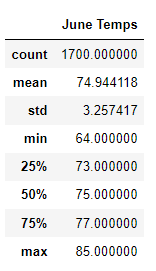

# Surfs_Up

## Purpose of the Analysis
The purpose of this analysis is to examine the temperatures observed in Oahu, Hawaii in order to see if an Ice Cream and Surf Shop is sustainable year round. THis analysis will look at the months of June and December for temperatures gathered from 2010 to 2017.

### Resources Used
- Python
	- SQL Alchemy
	- Pandas
- Jupyter Notebook

## Results
**All results recorded in Fahrenheit**

#### June Results

- Average Temperature: 74.94

- Max Temperature: 85

- Min Temperature: 64

The temperatures recorded in June typically were observed in the low 70s with 50% of temperatures between 73 and 77. Temperatures never were recorded to rise over 85 or below 64.

#### December Results

- Average Temperature: 71.04

- Max Temperature: 83

- Min Temperature: 56

The temperatures recorded in June typically were observed in the low 70s with 50% of temperatures between 69 and 74. Temperatures never were recorded to rise over 83 or below 56.

## Summary

The analysis shows that temperatures were on average slightly higher by a bit less than 4 degrees in June than in December, which really isn't that much of a difference. Temperatures in both months were never recorded above 85 or below 56, and this range suggests sustainability year round for the business.

### Additonal Analysis

An additional analysis was added to show the precipitation levels during both June and December. On average, precipitation in December showed to be almost twice as much as in June. This suggests the shop might want to order more umbrellas during the months around December!

#### June Results

#### December Results

